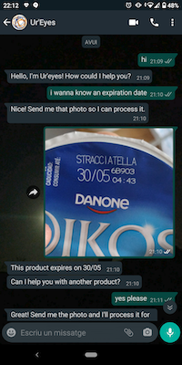
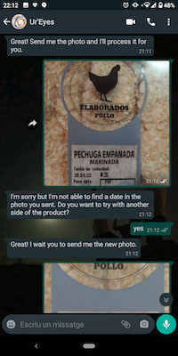
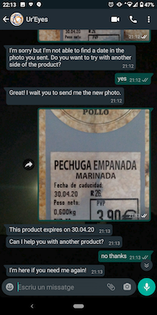
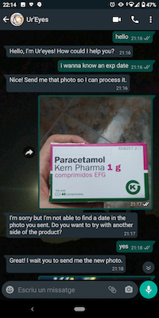
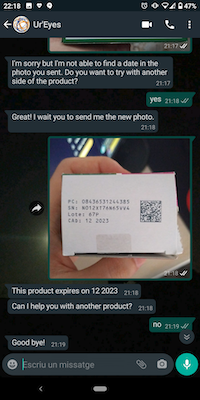
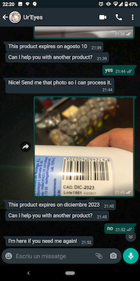

# Ur'Eyes
## A VISUAL SUPPORT FOR VISUALLY IMPAIRED PEOPLE IN TIMES OF KEEPING DISTANCE RESPONSE TO CALL FOR CODE - COVID19 - 2020

### Context
#### COVID-19 challenge

By the end of April 2020, while submitting this proposal, coronavirus COVID-19 has spread around the whole world, and it is currently affecting about 210 countries. It has caused 203.773 of deaths and a total of 2.937.822 cases in just four months by the end of April.

In such an unprecedented situation, governments, under tremendous pressure, have reacted lacking the experience to deal with the problem. Airports have been closed, mobility has been limited, jobs have shifted to be more digital, and social distancing has been recommended or imposed in several forms.

Many decisions have been made in a rush; decisions that have been taken for the totallity of the population and with no time to look into specific cases, which has left people with a physical or mental disability somehow unprotected or not considered in this situation.

Visual impaired and the blind population are among those “forgotten” groups, and the purpose of this solution is to help this group get the support they need using AI-powered digital solutions. 

#### Current situation and market size

According to the World Health Organization, visual impairment and blindness are estimated to affect 4.25% of the global population representing 285M people. Out of that, 39M are blind people. 

### Pains
#### Identified use cases affected by COVID-19´s communication crisis

Our research on the subject has revealed three issues in which this life-changing event have affected them:

- **Information accessibility**: due to the visual impairment, it is particularly relevant for people with this disability to have a narrow range of trustable sources of information. In this situation, they refer to official and, in particular, health care websites as their preferred sources. However, in this rush, the digital editions of such journals and reports have forgotten to use metadata that describe images and tables in the digital platforms, which is a cause of frustration.
- **Family logistics**: shopping for food is a daily task made possible thanks to digital technologies, and the advances in online shopping. However, due to the COVID-19 situation, the demands for online shopping delivery have risen dramatically and supermarkets often cannot cope with the growing demand. This affects people with a visual impairment. Going to a physical store can be a health hazard as they can be more exposed than other groups to the virus.
- **Community support**: in order to complete basic tasks at home that require visual inspection, people with visual impairment or blindness used to get support from their neighbours. According to our research, a typical daily task is to check the expiration date of food products or prescription drugs. Although they do create some routines to deal with this, it is common to find support in their neighbours. Now, due to the social distance requirement, this support is no longer feasible, being a cause of frustration.
### Challenge  

#### Helping visual impaired people

The purpose of this submission is to provide a solution aiming to help with this *Communication Crisis* and, on the other hand, look for a contribution via *Community Collaboration*. 

Our goal is to extend the visual capabilities of visually blind and impaired people via computer vision, NLP, and voice processing capabilities along with the whole roadmap of the solution.

Our challenge is to **“develop a solution that can visually help visually impaired people during this coronavirus crisis by AI powered solution and community support”**.

Our research revealed that some major providers, like Google and Microsoft, have offered some functionalities to help people with visual impairments. They do offer object detection, object classification, and some help with reading. However, food products or medicine recognition, or the detection of their expiration dates are not features included in their solutions.

Our proposal aims to fill this gap via a mobile app.


### Approach and User Story

#### Customer Journey

The diagram below shows the customer journey of a visual impaired person who needs support from others and this time will be assisted by our solution

****

#### User story

JJ is 35 years old, he is blind since his childhood, and lives with his wife who is also blind. They can fully mobile and can take care of themselves. During the coronavirus crisis, they have obeyed the measures established by the Government and have confined themselves at home, staying away from family, friends and neighbors who offered them assistance when needed. 
Before Covid-19, JJ used to go to his neighbour and ask for help with the reading of the expiration date of food products.

“JJ is going to do his shopping today, and he wants to check the expiration date of some products in the fridge. He takes his phone, and via Whatsapp, he chats with ur´eyes, his virtual assistant. He writes that he wants to identify a product. After taking and sending a picture of the product, the assistant responds with the description of the product. After this, he tells the virtual assistant that he wants to know the expiration date of the product. He gets a confirmation that he is in mode “expiration detector”. JJ then takes a photo. After every image that he uploads, he receives the same text with the expiration date of the product. After this, he can get to “product detector” or “other assistance” via proper instructions to the bot.”

### Architecture and Roadmap

  #### Roadmap description
****

#### Initial architecture

To build the solution, and to have a clear deliverable for submission on April 27th, we have defined the following architecture for an MVP.

This MVP aims to prove the concept of the relevant components: Watson Assistant, a dialogue flow developed in Node-red, and Object Character Recognition.
In this case, user communication occurs via Whatsapp (interviews revealed that reading/chatting on mobile is a common feasible task for visual impaired people).


****

#### App architecture

During the second phase of development, we aim to improve the user experience. For this, we shall:

- create an appropriate mobile app interface to allow more flexibility on the user interactions.

- enable voice interactions for target definition and app response (including multiple languages).

- process video images in streaming and send feedback of focus and reached the target.

Depending on the user experience and technology validation during agile development, we shall consider the option of passing some of the features from the cloud to the edge.


****

During the last phase we shall introduce collaborative capabilities in the app so that contacts can help in case of not successful app assistance.

This will serve as an annotation mechanism for future algorithm retraining.

****
### Mockup 

#### Expiration date detection use cases

*Ur´Eyes*, virtual assistant allows to:

-   Identify a product based on it barcode
    
-   Detect expiration date of a product
   
For instance:
    
**Food product**

****

**Prescription drugs**



[Here](https://photos.google.com/share/AF1QipMrZ1bvJsKc9pXBrlYanMSzS1ZCriFNixZTyBI2gFwN2aHuRJvaycsYu0aBocsGIA/photo/AF1QipNcFIl-x4Nj2SIYQV1wAIqVV8RNUvV7z9cxOrc1?key=S2JOdmFLVi02dTJ4RllLMVdLRk1VYWlzYl9MSUdn) you can see the Chatbot in action.
### Claim  
*Ur´Eyes* shall be the reference solutions for helping visual impaired and blind people during coronavirus communication crisis.


## Installation guide

In order to download and test the project in your own machine you will need node-red installed. You can follow the [official documentation](https://nodered.org/docs/getting-started/local).

Once installed you should clone the project in a directory of your choice with:
```
git clone https://github.com/EnzymeAdvG/ureyes.git 
```
Open a terminal in this folder and type:

```
cd ureyes
```
Then install the required dependencies by typing:
```
npm install
```
Go back to the original folder
```
cd ..
```
And finally execute node-red
```
node-red -u ureyes
```

This will open a browser page in the localhost:1880 where you will be able to see the flow.

In order to bring it to a productive scenario a couple more pieces of software are needed:
  - IBM Cloudant 
  - Watson Assistant
  - Access to the Whatsapp Business API

Once this products have been deployed you will need to update the flow.set information inside the "Configuration" Node with the following information:
  - IBM Cloudant credentials 
  - Watson Assistant credentials
  - Whatsapp Acess Token & Channel

In addition to that, many more IBM Services can be added to improve the app and expand its functionalities, such as:
  - Language Translator 
  - Text to Speech
  - Speech to Text
  - IBM Cloud Storage
  - IBM Machine Learning
  - IBM Visual Insights