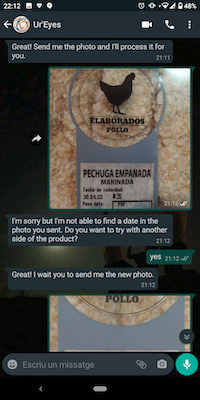
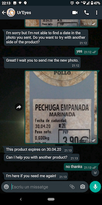
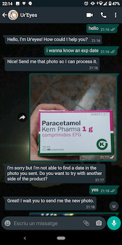
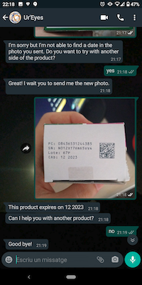
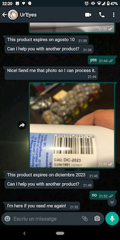

# Ur'Eyes
## A VISUAL SUPPORT FOR VISUALLY IMPAIRED PEOPLE IN TIMES OF KEEPING DISTANCE RESPONSE TO CALL FOR CODE - COVID19 - 2020

### Context
#### COVID-19 challenge

By the end of April 2020, while submitting this proposal, coronavirus COVID-19 has spread around the whole world, and it is currently affecting about 210 countries. It has caused 203.773 of deaths and a total of 2.937.822 cases in just four months by the end of April.

In such an unprecedented situation, governments, under tremendous pressure, have reacted lacking the experience to deal with the problem. Airports have been closed, jobs have shifted to be more digital, and social distancing has been recommended or imposed in several forms.

In a rush, many decisions have been made; decisions that have had to be general and with no time to look into specific cases. This rush has left people with some physical or mental disablement somehow unprotected or not considered in this situation.

Visual impaired and the blind population is among those “forgotten” groups, and the purpose of this solution is to help this group getting support from AI-powered digital solutions.

#### Current situation and market size

According to the World Health Organization, Visual impairment and blindness are estimated to affect 4.25% of the global population representing 285 million people. Out of that, 39M are blind people.

### Pains
#### Identified use cases affected by COVID-19´s communication crisis

Following our research on the subject revealed three moments in which this life-changing event have affected them:

- **Information accessibility**: due to the visual impairment, it is particularly relevant for people with this disability to have a narrow range of trustable sources of information. In this situation, they refer to official and, in particular, health care websites to be the preferred ones. However, in this rush, the digital editions of such journals and reports have forgotten to use metadata that describe images and tables in the digital platforms, which is a cause of frustration.

- **Family logistics**: shopping food is a daily event for which thanks to digital technologies, and advancement in online shopping, it has got facilitated. However, due to this COVID-19 situation, the online serving system has collapsed and made it almost impossible to access, not having a back door for people with impairment. Going to physical stores can be currently a cause of trouble and higher exposure to the virus than other people.

- **Community support**: for some activities at home that need some visual inspection, people with visual impairment or blindness often get support from their neighbours. According to our research, a typical daily action is to evaluate the expiration date of food products or prescription drugs. Although they do create some routines to deal with this, it is common to find support in their neighbours. Now, due to the social distance requirement, this support is no longer feasible, being a cause of frustration.

### Challenge  

#### Helping visual impaired people

The purpose of this submission is to provide a solution aiming to help with this Communication Crisis and, on the other hand, looking for a contribution via Community Collaboration.

Our goal is to extend the visual capabilities of visually blind and impaired people via computer vision, NLP, and voice processing capabilities along with the whole roadmap of the solution.

Our challenge is to “Develop a solution that can visually help visually impaired people during this coronavirus crisis by AI powered solution and community support”

Our research revealed that some major providers, like Google and Microsoft, have offered some functionalities to help people with visual impairments. They do offer object detection, object classification, and some help with reading. However, nor food product or medicine recognition, neither their corresponding expiration dates detection are features of their solutions.

Our proposal aims to fill this gap via a mobile app.


### Approach and User Story

#### Customer Journey

The diagram below shows the customer journey of a visual impaired person who needs support from others and this time will be assisted by our solution

****

#### User story

JJ is 35 years old, he is blind since his childhood, and his wife is also blind. They do live together and take care of themselves. During the coronavirus crisis, they have been forced to get social distancing from neighbours as many other citizens. JJ used to go to his neighbour and ask for help with the reading of the expiration date of food products.

“JJ is going to do the shopping of today, and he wants to check the expiration date of some products in the fridge. He takes his phone, and via Whatsapp, he chats with *Ur´Eyes*, his virtual assistant. He writes that he wants to identify a product. After taking and sending a picture of the product, the assistant responds with the description of the product. After this, he tells the virtual assistant that he wants to know the expiration date of the product. He gets a confirmation that he is in mode “expiration detector”. JJ then takes a photo. After every image that he uploads, he receives the same text with the expiration date of the product. After this, he can get to “product detector” or “other assistance” via proper instructions to the bot.”

We do not cover the user story bellow in the code deployed for this submission of 04/27/202, but it tells the user experience we shall cover with an app for the final dateline. Our team shall develop the same functionality but for a mobile app. The app will include voice to text and text to voice, video streaming, and image processing and ocr improvements to provide JJ a smoother user experience.

“JJ is going to do the shopping of today, and he wants to check the expiration date of some products in the fridge. He takes his phone and opens the app *Ur´Eyes*. He tells via voice that he wants to identify a product, and the app opens the camera. The app searches on the video for a QR or a barcode. Once *Ur´Eyes* app finds the product barcode, it makes a beep and tells via voice the product description. JJ requests via voice the expiration date of the product and repeats the same procedure. Once the app finds the expiration date, it communicates it via voice. In case that JJ do not find it he will share the picture via appropriate interface with someone in his community that will provide the feedback to JJ“

### Architecture and Roadmap

  #### Roadmap description
****

#### Initial architecture

To build the solution, and to have a clear deliverable for submission on April 27th, we have defined the following architecture for an MVP.

This MVP aims to prove the concept of the relevant components: Watson Conversation, Dialogue flow in Node-red, and Object Character Recognition.

In this case, user communication occurs via Whatsapp.

****

#### App architecture

During the second phase of development, we aim to improve the user experience. For this, we shall:

- Create an appropriate mobile app interface to allow more flexibility on the user interactions

- Enable voice interactions for target definition and app response. (we expect to include multiple languages)

- Process video images in streaming and send feedback of focus and reached the target.

****

### Mockup 

#### Expiration date detection use cases

*Ur´Eyes*, virtual assistant allows:

-   Identifies a product based on it barcode
    
-   Detect expiration date of product
   
   For instance:
    
**Food product**

****

**Prescription drugs**


### Claim  
*Ur´Eyes* shall be the reference solutions for helping visual impaired and blind people during coronavirus communication crisis


## Installation guide

In order to install and test the project in your own machine you will need node-red installed. You can follow the [official documentation](https://nodered.org/docs/getting-started/local).

Once installed you should clone the project in a directory of your choice with:
```
git clone https://github.com/EnzymeAdvG/ureyes.git 
```
Open a terminal in this folder and type:

```
cd ureyes
```
Then install the required dependencies by typing:
```
npm install
```
Go back to the original folder
```
cd ..
```
And finally execute node-red
```
node-red -u ureyes
```

This will open a browser page in the localhost:1880 by default where you will be able to see the flow.

In order to bring it to a productive scenario a couple more pieces of software are needed:
  - IBM Cloudant 
  - Watson Assistant
  - Access to the Whatsapp Business API
Once this products have been deployed you will need to update the flow.set information inside the "Configuration" Node with the following information:
  - IBM Cloudant credentials 
  - Watson Assistant credentials
  - Whatsapp Acess Token & Channel
